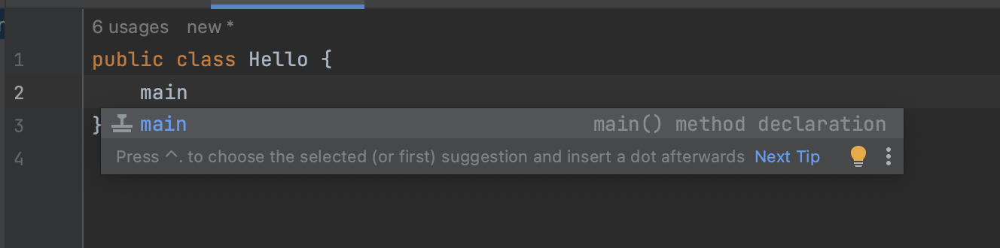
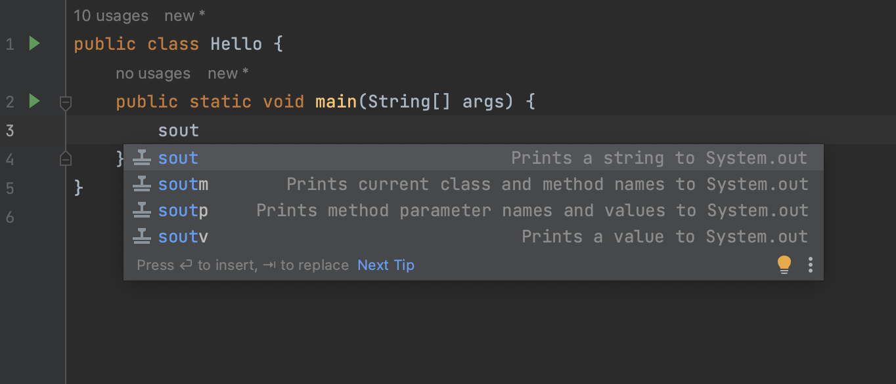

# Coding Yoga

This is coding Yoga.

I will guide you through some moves with `Java 17`, `git` and `IntelliJ`.

Before you continue, please make sure you check [the few prerequisites](prerequisites.md) for this yoga session.

At this point, I assume you have `git` installed and an up-to-date version of `IntelliJ` (either `Community Edition`
or `Ultimate Edition`) installed

Now, you can begin to relax and just follow my steps.

## 01 - Travel in time

```shell
git checkout 01-travel-in-time
```

For the instructions I will give you, there often a lot of different ways to do so.
It can be mouse moves, keyboard moves, shortcuts, live templates and so on. At the beginning of this session, I will
give you only one way to do the basic moves. If you already know a different way to do it more efficiently, feel free to
use it!

Also, you may have remarked the `git checkout 01-travel-in-time` snippet at the beginning of this chapter. Each new
chapter will have a `git tag` that is a save point. This will allow to “travel in time” with `git`.

For the next step, please checkout the following `git tag`.

```shell
git checkout 02-create-a-file
```

## 02 - Create a file

```shell
git checkout 02-create-a-file
```

We will create a file named `notes.md`.

On the left pane,

- right click on `coding-yoga`
- new
- file
- type "notes.md"

This file has a different color than the other files (dark yellow or dark red). It means it is `ignored by git`. You can
check the files ignored by `git` by opening the `.gitignore` file.

To open the `.gitignore` file, on the left pane, double-click on its name (`.gitignore`).

It will open in the current editor view.

You can scroll down this file with your mouse or your keyboard arrows.

You should see the following lines:

```gitignore
### Yoga unversioned files
notes.md
```

Now, switch back to the `notes.md` file by double-clicking on its name (`notes.md`).

I encourage you to note the useful tips you will learn during this yoga session into this file.

## 03 - Hello world Java

```shell
git checkout 03-hello-world-java
```

We will now create a new `Java class`.

On the `left pane`

- unfold `src/main/java`
- right click on `java`
- New
- Java class
- type "Hello" and then the `Enter Key`

You will be prompted to add the file to `git`. You can choose `Yes` or `No` either way does not matter for now.

Now, on the `left pane`, there is a `Java class` called `Hello`.

By default, it contains:

```java
public class Hello {
}
```

Now, create a `main method` like this:

```java
public class Hello {
    public static void main(String[] args) {

    }
}
```

Delete the code you just wrote.

It is back to :

```java
public class Hello {
}
```

Place your cursor between the brackets (between `{` and `}`).

Begin type `main`.

A contextual menu appears with a suggestion of `live template` called `main` `main() method declaration`.



Type the `Enter key` or `Tab key` to finish the template completion.

```java
public class Hello {
    public static void main(String[] args) {

    }
}
```

Add the following line inside the new code created : `System.out.println("Hello World");`

```java
public class Hello {
    public static void main(String[] args) {
        System.out.println("Hello World!");
    }
}
```

Now, remove the code you just wrote.

And type `sout`.

A contextual menu appears with a suggestion of `live template` called `sout` `Prints a string to System.out`.



Hit `Enter key` or `Tab key`, then type `"Hello World!"`

```java
public class Hello {
    public static void main(String[] args) {
        System.out.println("Hello World!");
    }
}
```

## 04 - Running Hello World

```shell
git checkout 04-running-hello-world
```